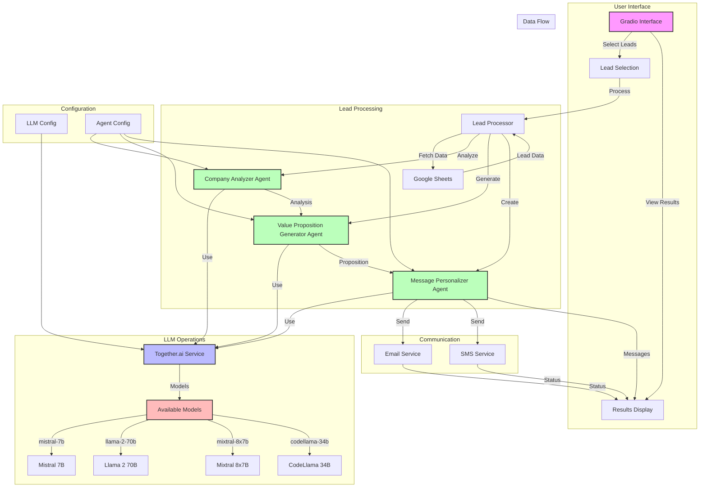

# LLM Application Flowchart

## Layer 1: User Interface (UI)
- **Gradio Interface** (`src/ui/gradio_interface.py`)
  - Displays pending leads and processing logs.
  - Provides buttons to refresh leads and run the agent.

## Layer 2: Core Agent Logic
- **ABM Lead Generation Agent** (`src/core/abm_agent.py`)
  - Initializes configuration and services.
  - Processes leads by verifying emails and sending messages.
  - Uses smolagents for LLM interactions.

## Layer 3: Services
- **Google Sheets Service** (`src/services/sheets_service.py`)
  - Manages interactions with Google Sheets.
  - Retrieves pending leads and updates lead statuses.
- **Messaging Service** (`src/services/messaging_service.py`)
  - Handles email and SMS communications.
  - Formats and sends messages to leads.

## Layer 4: Configuration
- **Config** (`src/core/config.py`)
  - Loads and validates environment variables.
  - Provides configuration settings for the application.

## Layer 5: Testing
- **Test Suite** (`tests/`)
  - Unit tests for UI, agent logic, and services.
  - Ensures functionality and error handling.

## Layer 6: Application Entry Point
- **Main Application** (`app.py`)
  - Sets up the environment and initializes the Gradio UI.
  - Launches the application on a specified server and port.

